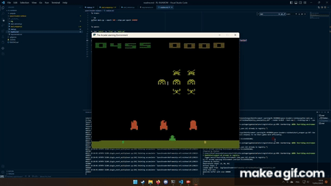

# Implementation of Rainbow: Combining Improvements in Deep Reinforcement Learning <!-- omit in toc -->

This is part of a Reinforcement Learning project from two students of Ecole Polytechnique / IP Paris. It consists in a python implementation of the Rainbow algorithm on two different Atari games:

- [CartPole-v1](https://gym.openai.com/envs/CartPole-v1/) test environment;
- [SpaceInvadersNoFrameskip-v4](https://gym.openai.com/envs/SpaceInvadersNoFrameskip-v4/) Atari environment.

The purpose of having two different environments is to show that the algorithm works on both simple and complex environments. The code is based on the paper [1], but the implementation of the first part comes from [2], and to use Atari Environment, [3] was used.

## Table of Contents <!-- omit in toc -->

- [Authors](#authors)
- [How to run the code](#how-to-run-the-code)
- [Requirements](#requirements)
- [Examples video](#examples-video)
  - [CartPole-v1](#cartpole-v1)
  - [SpaceInvadersNoFrameskip-v4](#spaceinvadersnoframeskip-v4)
- [Bibliography](#bibliography)


## Authors
 
| First Name | Last Name  | E-mail address                    |
| ---------- | ---------- | --------------------------------- |
| Kellian    | COTTART    | kellian.cottart@polytechnique.edu |
| Luc        | GENSBITTEL | luc.gensbittel@polytechnique.edu  |

## How to run the code

1. Clone the repository with:
   ```bash
   git clone
   ```
2. Pick the folder you're interested in (CartPole or SpaceInvaders):
   ```bash
   cd cartpole #or cd space-invaders
   ```
3. Start by installing the dependencies with:
   ```bash
   pip install -r requirements.txt
   ```
Individual folders have their own README.md file, with more details about the code.

> **Note:** You can run space-invaders with several parameters, to change the number of epochs, the number of frames to render... You can find the list of parameters in the file `main.py`, in the folder `space-invaders`.

## Requirements

All the code was made to be compatible with `Python 3.9.15`. Then, running the requirements file will install all the dependencies needed to run the code.

Some known libraries are:
- `numpy` for the mathematical operations;
- `torch` for the neural networks;
- `matplotlib` for the plots;
- `gym` for the environments;
- `atari-py` for the Atari environment;
- `autorom` for the Atari games roms validation;
- `tianshou` for the RL algorithms of the `space-invaders` folder, and reference [3].

## Examples video

### CartPole-v1

[](./cartpole/videos/rainbow/cartPole-v1/rl-video-episode-0.mp4)

### SpaceInvadersNoFrameskip-v4

[](./space-invaders/videos/2023_02_13_191552.mp4)

## Bibliography

[1] "Rainbow: Combining Improvements in Deep Reinforcement Learning", Hessel et al., 2017, https://arxiv.org/pdf/1710.02298.pdf  
[2] "Rainbow Is All you Need", https://github.com/Curt-Park/rainbow-is-all-you-need/  
[3] "Tianshou", https://github.com/thu-ml/tianshou
