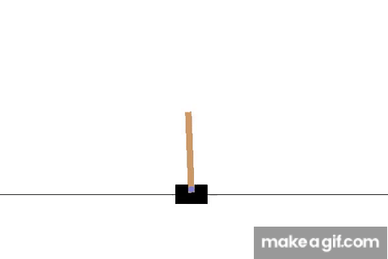

# CartPole-v1

This is the implementatiion of the Rainbow algorithm [1] as specified by "Rainbow is all you need" [2] for the `CartPole-v1` environment.
## Pre-requisites

```py
pip install -r requirements.txt
```

## Start the program

```py
python main.py
```
## Results

The following results are obtained by running the code on a single GPU (NVIDIA GeForce GTX 3070). The [video](./videos/rainbow/cartPole-v1/rl-video-episode-0.mp4) is the result of the algorithm.

[](./videos/rainbow/cartPole-v1/rl-video-episode-0.mp4)

## Bibliography

[1] "Rainbow: Combining Improvements in Deep Reinforcement Learning", Hessel et al., 2017, https://arxiv.org/pdf/1710.02298.pdf  
[2] "Rainbow Is All you Need", https://github.com/Curt-Park/rainbow-is-all-you-need/
